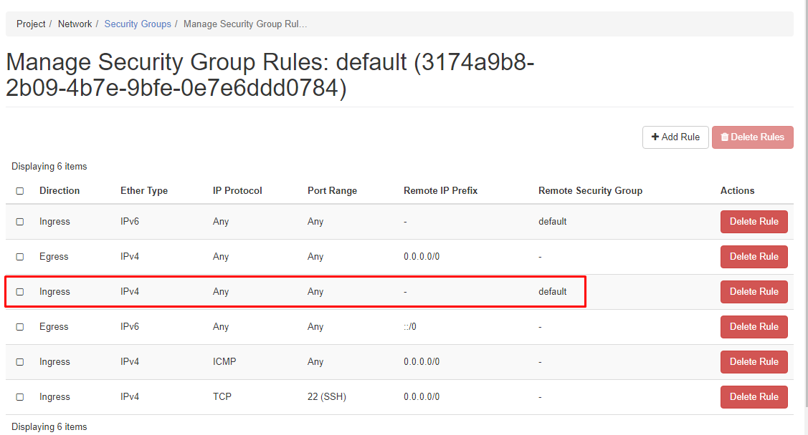

## Cài đặt

### Devstack

Thực hiện cài đặt bằng devstack rất đơn giản.

**Bước 1**:

Chuẩn bị một máy chủ cài có cấu hình 4 vCPU, 8GB RAM, 60GB HDD, 02 interface (public + private). Cài đặt hệ điều hành Ubuntu 16.04 64bits.

Máy có kết nối internet, và đã cài đặt sẵn các gói `wget, git`
```sh
apt-get update -y && apt-get dist-upgrade -y && apt-get install wget git -y
```

**Bước 2**:

Đăng nhập vào với quyền `root` và tải script sau về:

- Nếu sử dụng OpenStack ocata
```sh
wget https://raw.githubusercontent.com/openstack/octavia/stable/ocata/devstack/contrib/new-octavia-devstack.sh
```

- Nếu sử dụng OpenStack pike:
```sh
wget https://raw.githubusercontent.com/openstack/octavia/stable/pike/devstack/contrib/new-octavia-devstack.sh
```

**Bước 3**:

Cho script quyền thực thi
```sh
chmod +x new-octavia-devstack.sh
```

Chạy lệnh sau để bắt đầu cài đặt
```sh
./new-octavia-devstack.sh
```

Quá trình cài đặt mất khoảng 1h30p. Vì cài đặt từ source nên sẽ bao gồm cả bước biên dịch và cài đặt.

**Note**: Trong quá trình cài đặt devstack Octavia trên bản OpenStack ocata sẽ bị lỗi và ko thể tiếp tục được nữa. Nguyên nhân chưa rõ.

**Bước 4** (Tùy chọn, nhưng tốt nhất là thao tác lệnh)

Việc cài đặt vẫn thiếu project horizon, nên bạn cần cài đặt thêm gói horizon nếu muốn thao tác và xem qua web.

Từ user `stack`, ta chạy lệnh sau:
```sh
sudo apt-get install openstack-dashboard -y
```

Cài đặt xong, ta chay đổi cấu hình của file `/etc/openstack-dashboard/local_settings.py` như sau:
```sh
OPENSTACK_API_VERSIONS = {
    "identity": 3,
    "image": 2,
    "volume": 2,
}

OPENSTACK_KEYSTONE_DEFAULT_DOMAIN = "Default"

OPENSTACK_HOST = "172.16.68.59"

OPENSTACK_KEYSTONE_URL = "http://%s/identity" % OPENSTACK_HOST

OPENSTACK_KEYSTONE_DEFAULT_ROLE = "user"

SESSION_ENGINE = 'django.contrib.sessions.backends.cache'
OPENSTACK_KEYSTONE_MULTIDOMAIN_SUPPORT = True

TIME_ZONE = "Asia/Ho_Chi_Minh"
```

Thực hiện khởi động lại `apache2` để bắt đầu sử dụng `horizon`
```sh
sudo service apache2 reload
```

**Note**: Khi cài đặt xong devstack, bạn cứ để vậy mà lab tiếp, ko nên khởi động lại. vì một số cấu hình chưa được thiết lập persitent, nên lúc restart sẽ mất.

### Package

Cài đặt OpenStack theo hướng dẫn [sau]()

**Cách 1**:

Cài đặt Neutron LBaaS v2 bằng lệnh:
```sh
apt-get install -y neutron-lbaasv2-agent
```

Chỉnh sửa lại các tập tin cấu hình của Neutron liên quan tới LBaaS. 

Trước tiên chỉnh sửa file `/etc/default/neutron-server`, thêm nội dung sau vào cuối file
```sh
DAEMON_ARGS="$DAEMON_ARGS --config-file=/etc/neutron/neutron_lbaas.conf --config-file=/etc/neutron/services_lbaas.conf"
```

Tiếp theo, mở file `/etc/neutron/neutron.conf` và thêm vào plugin lbaas vào dòng có `service_plugins`
```sh
service_plugins = router,neutron_lbaas.services.loadbalancer.plugin.LoadBalancerPluginv2
```

Tiếp tục chỉnh sửa file `/etc/neutron/neutron_lbaas.conf` với các nội dung tương ứng sau
```sh
[service_providers]
service_provider = service_provider = LOADBALANCERV2:Octavia:neutron_lbaas.drivers.octavia.driver.OctaviaDriver:default


[service_auth]
auth_url = http://controller:35357/v3
admin_user = octavia
admin_tenant_name = service
admin_password = tan124
admin_user_domain = default
admin_project_domain = default
region = RegionOne
auth_version = 3
```

Chỉnh sửa file `/etc/neutron/services_lbaas.conf` với các nội dung sau:
```sh
[octavia]
base_url = http://controller:9876/
```

Cập nhật lại DB của Neutron bằng lệnh:
```sh
neutron-db-manage --config-file /etc/neutron/neutron.conf --config-file /etc/neutron/plugins/ml2/ml2_conf.ini upgrade head
```

Cần thực hiện cài đặt octavia. Đầu tiên ta khởi tạo database trên node controller
```sh
mysql> CREATE DATABASE octavia;
mysql> GRANT ALL PRIVILEGES ON octavia.* TO 'octavia'@'localhost' IDENTIFIED BY 'tan124';
mysql> GRANT ALL PRIVILEGES ON octavia.* TO 'octavia'@'%' IDENTIFIED BY 'tan124';
mysql> flush privileges;
```

Tiếp theo ta khởi tạo endpoint cho octavia
```sh
openstack user create --domain default --password tan124 octavia
openstack role add --project service --user octavia admin
openstack service create --name octavia --description "OpenStack Load Balancer" load-balancer
openstack endpoint create load-balancer public http://controller:9876/ --region RegionOne 
openstack endpoint create load-balancer admin http://controller:9876/ --region RegionOne 
openstack endpoint create load-balancer internal http://controller:9876/ --region RegionOne
```

Cài đặt từ pip, vì octavia chưa được đóng gói thành package. 

```sh
apt-get install -y python-pip

pip install -y octavia 
```

Tạo một flavor để cho amphora sử dụng khi khởi tạo bằng lệnh.
```sh
root@controller:/usr/local# nova flavor-create --is-public False m1.amphora auto 1024 2 1
+--------------------------------------+------------+-----------+------+-----------+------+-------+-------------+-----------+
| ID                                   | Name       | Memory_MB | Disk | Ephemeral | Swap | VCPUs | RXTX_Factor | Is_Public |
+--------------------------------------+------------+-----------+------+-----------+------+-------+-------------+-----------+
| 55afa5a1-1b67-43b0-a3cc-f4420e4526de | m1.amphora | 1024      | 2    | 0         |      | 1     | 1.0         | False     |
+--------------------------------------+------------+-----------+------+-----------+------+-------+-------------+-----------+
```

Ta sử dụng IP của flavor vừa tạo để đưa vào config trong octavia. tại file `/usr/local/etc/octavia/octavia.conf`
```sh
[controller_worker]
amp_flavor_id = 55afa5a1-1b67-43b0-a3cc-f4420e4526de
```

Để có thể ssh vào amphora ta cần sử dụng keypair. ta tạo một cặp key bằng lệnh
```sh
mkdir -p /usr/local/etc/octavia/.ssh && cd /usr/local/etc/octavia/.ssh
ssh-keygen -b 2048 -t rsa -N "" -f octavia
```

Sau đó import cặp key vào trong nova 
```sh
nova keypair-add --pub-key octavia.pub octavia
```

Thực hiện chỉnh sửa cấu hình file `/usr/local/etc/octavia/octavia.conf` với keypair vừa tạo trên
```sh
[controller_worker]
amp_ssh_key_name = octavia
```

Giữa amphora API và Octavia controller tương tác 2 chiều với certificate xác thực. Ta tạo cặp SSL certificate bằng script `create_certificates.sh` như sau 
```sh
#!/bin/bash

# USAGE: <certificate directory> <openssl.cnf (example in etc/certificate)
#Those are certificates for testing will be generated
#
#* ca_01.pem is a certificate authority file
#* server.pem combines a key and a cert from this certificate authority
#* client.key the client key
#* client.pem the client certificate
#
#You will need to copy them to places the agent_api server/client can find and
#specify it in the config.
#
#Example for client use:
#
#curl -k -v --key client.key --cacert ca_01.pem --cert client.pem https://0.0.0.0:9443/
#
#
#Notes:
#For production use the ca issuing the client certificate and the ca issuing the server cetrificate
#need to be different so a hacker can't just use the server certificate from a compromised amphora
#to control all the others.
#
#Sources:
#* https://communities.bmc.com/community/bmcdn/bmc_atrium_and_foundation_technologies/
#discovery/blog/2014/09/03/the-pulse-create-your-own-personal-ca-with-openssl
#  This describes how to create a CA and sign requests
#* https://www.digitalocean.com/community/tutorials/
#openssl-essentials-working-with-ssl-certificates-private-keys-and-csrs -
#how to issue csr and much more

## Create CA

# Create directories
CERT_DIR=$1
OPEN_SSL_CONF=$2 # etc/certificates/openssl.cnf
VALIDITY_DAYS=${3:-18250} # defaults to 50 years

echo $CERT_DIR

mkdir -p $CERT_DIR
cd $CERT_DIR
mkdir newcerts private
chmod 700 private

# prepare files
touch index.txt
echo 01 > serial


echo "Create the CA's private and public keypair (2k long)"
openssl genrsa -passout pass:foobar -des3 -out private/cakey.pem 2048

echo "You will be asked to enter some information about the certificate."
openssl req -x509 -passin pass:foobar -new -nodes -key private/cakey.pem \
        -config $OPEN_SSL_CONF \
        -subj "/C=US/ST=Denial/L=Springfield/O=Dis/CN=www.example.com" \
        -days $VALIDITY_DAYS \
        -out ca_01.pem

echo "Here is the certificate"
openssl x509 -in ca_01.pem -text -noout

## Create Server/Client CSR
echo "Generate a server key and a CSR"
openssl req \
       -newkey rsa:2048 -nodes -keyout client.key \
       -subj "/C=US/ST=Denial/L=Springfield/O=Dis/CN=www.example.com" \
       -out client.csr

echo "Sign request"
openssl ca -passin pass:foobar -config $OPEN_SSL_CONF -in client.csr \
           -days $VALIDITY_DAYS -out client-.pem -batch

echo "Generate single pem client.pem"
cat client-.pem client.key > client.pem

echo "Note: For production use the ca issuing the client certificate and the ca issuing the server"
echo "certificate need to be different so a hacker can't just use the server certificate from a"
echo "compromised amphora to control all the others."
echo "\nTo use the certificates copy them to the directory specified in the octavia.conf"
```

Cho script quyền thực thi
```sh
chmod +x create_certificates.sh
```

Chỉnh sửa lại file `/etc/ssl/openssl.cnf` một số nội dung mặc định thành như sau
```sh
[ CA_default ]
dir                = ./
certificate        = $dir/ca_01.pem
```

Tạo thư mục chứa các cert
```sh
mkdir -p /usr/local/etc/octavia/certs
```

Sử dụng lệnh sau để tạo các cert:
```sh
source /root/create_certificates.sh /usr/local/etc/octavia/certs /etc/ssl/openssl.cnf
```

Sử dụng các cert vừa tạo để cho vào file `/usr/local/etc/octavia/octavia.conf`
```sh
[certificates]
ca_certificate = /usr/local/etc/octavia/certs/ca_01.pem
ca_private_key = /usr/local/etc/octavia/certs/private/cakey.pem
ca_private_key_passphrase = foobar
[haproxy_amphora]
client_cert = /usr/local/etc/octavia/certs/client.pem
server_ca = /usr/local/etc/octavia/certs/ca_01.pem
```

Tạo một Loadbalancer management network để cho controller giao tiếp với amphorae và ngược lại. 
Tất cả các amphorae mà Octavia khởi tạo sẽ đều có interface và địa chỉ IP của network này.
```sh
root@controller:/usr/local/etc/octavia/certs# neutron net-create lb-mgmt-net
neutron CLI is deprecated and will be removed in the future. Use openstack CLI instead.
Created a new network:
+---------------------------+--------------------------------------+
| Field                     | Value                                |
+---------------------------+--------------------------------------+
| admin_state_up            | True                                 |
| availability_zone_hints   |                                      |
| availability_zones        |                                      |
| created_at                | 2017-12-05T08:51:38Z                 |
| description               |                                      |
| id                        | 9599f74a-eadd-49e3-a045-6e7c0246273a |
| ipv4_address_scope        |                                      |
| ipv6_address_scope        |                                      |
| is_default                | False                                |
| mtu                       | 1450                                 |
| name                      | lb-mgmt-net                          |
| port_security_enabled     | True                                 |
| project_id                | b83b5c2875774d4aa46e8a029f7a4b0e     |
| provider:network_type     | vxlan                                |
| provider:physical_network |                                      |
| provider:segmentation_id  | 24                                   |
| revision_number           | 2                                    |
| router:external           | False                                |
| shared                    | False                                |
| status                    | ACTIVE                               |
| subnets                   |                                      |
| tags                      |                                      |
| tenant_id                 | b83b5c2875774d4aa46e8a029f7a4b0e     |
| updated_at                | 2017-12-05T08:51:38Z                 |
+---------------------------+--------------------------------------+
```
==> lưu id của network lại `9599f74a-eadd-49e3-a045-6e7c0246273a`

Tạo subnet cho network vừa tạo
```sh
openstack subnet create lb-mgmt-subnet --subnet-range 192.168.10.0/24 --dhcp --dns-nameserver 8.8.8.8 --allocation-pool start=192.168.10.10,end=192.168.10.100 --description "Subnet for amphorae" --network lb-mgmt-net
```

Tạo một port manage trên network dành cho amphorae
```sh
neutron port-create --name octavia-health-manager-listen-port --binding:host_id=controller lb-mgmt-net
```

==> lưu lại 02 thông tin về `ip`, `id` và `mac_address` của lệnh tạo port trên
```sh
| fixed_ips             | {"subnet_id": "8ec27137-010b-43be-89d5-a4ede69fba8d", "ip_address": "192.168.10.13"} |
| id                    | 6d5babc6-90d0-4e6d-b796-2e198acefdbc                                                 |
| mac_address           | fa:16:3e:05:c7:dc                                                                    |
```

Ta gắn port vừa tạo ở trên vào br-int trong OpenStack
```sh
sudo ovs-vsctl -- --may-exist add-port br-int o-hm0 -- set Interface o-hm0 type=internal -- set Interface o-hm0 external-ids:iface-status=active -- set Interface o-hm0 external-ids:attached-mac=fa:16:3e:05:c7:dc -- set Interface o-hm0 external-ids:iface-id=6d5babc6-90d0-4e6d-b796-2e198acefdbc
sudo ip link set dev o-hm0 address fa:16:3e:05:c7:dc
sudo dhclient -v o-hm0
```

Tiếp tục chỉnh sửa cấu hình trong file `/usr/local/etc/octavia/octavia.conf` như sau:
```sh
[controller_worker]
amp_network = 9599f74a-eadd-49e3-a045-6e7c0246273a
[health_manager]
controller_ip_port_list = 192.168.10.13:5555
bind_ip = 192.168.10.13
bind_port = 5555
```

Khởi tạo neutron security group mà áp dụng khi khởi tạo amphorae trong LB network. Cần cho phép tất cả các package vào ra trên amphora API. (Thông thường là port 9443 hoặc 22)
```sh
neutron security-group-create lb-mgmt-sec-grp
neutron security-group-rule-create --protocol icmp lb-mgmt-sec-grp
neutron security-group-rule-create --protocol tcp --port-range-min 22 --port-range-max 22 lb-mgmt-sec-grp
neutron security-group-rule-create --protocol tcp --port-range-min 9443 --port-range-max 9443 lb-mgmt-sec-grp
neutron security-group-list
```

==> lưu lại giá trị `id` của security group `lb-mgmt-sec-grp`
```sh
| 58a96121-e6e7-451d-8ceb-315d12fe8ba9 | lb-mgmt-sec-grp | b83b5c2875774d4aa46e8a029f7a4b0e | egress, IPv4                                                         |
|                                      |                 |                                  | egress, IPv6                                                         |
|                                      |                 |                                  | ingress, IPv4, 22/tcp                                                |
|                                      |                 |                                  | ingress, IPv4, 9443/tcp                                              |
|                                      |                 |                                  | ingress, IPv4, icmp                                                  |
```

Thêm vào trong tập tin cấu hình `/usr/local/etc/octavia/octavia.conf` dòng sau
```sh
[controller_worker]
amp_secgroup_list = 58a96121-e6e7-451d-8ceb-315d12fe8ba9
```

Khởi tạo một image Amphorae bằng script tại [đây](https://github.com/TrongTan124/octavia/blob/stable/pike/diskimage-create/diskimage-create.sh) để tạo một cách tự động. Bạn nên tải toàn bộ git octavia về để build. do script viết có dùng nhiều function hoặc lib liên quan tới nhau. Nếu không, bạn phải cài lẻ thêm một vài package trước khi chạy script (sau này nếu thiếu thì cài bổ sung, tôi sử dụng Ubuntu 16.04 x64bits)
```sh
apt-get install -y qemu curl git wget kpartx
```

Sau khi tạo xong image, ta import vào glance

Sau đó chạy lệnh cài đặt 
```sh
$OCTAVIA_DIR/diskimage-create/diskimage-create.sh -s 2
```

Nếu bạn đã có 1 máy cài octavia bằng devstack thì ta export image amphora bằng lệnh
```sh
openstack image save amphora-x64-haproxy --file /tmp/amphora-x64-haproxy.qcow2
```

Hoặc vào thư mục `/opt/stack/octavia/diskimage-create` để tải về.

Sau đó chuyển sang máy chủ controller và import bằng lệnh:
```sh
openstack image create "amphora-x64-haproxy" --file amphora-x64-haproxy.qcow2 --disk-format qcow2 --container-format bare --public
```

Gắn tag cho image amphora vừa import vào glance bằng lệnh
```sh
glance image-tag-update ec33a687-b57b-46ae-bf4e-c2801aeb6479 amphora
```

Chỉnh sửa tập tin cấu hình `/usr/local/etc/octavia/octavia.conf`
```sh
[controller_worker]
amp_image_tag = amphora
```

Cập nhật database octavia
```sh
octavia-db-manage   upgrade head
```

**Cách 2**:

Tải git về và cài từ source
```sh
wget https://pypi.python.org/packages/31/83/845e8e2930735811d19ff189bc61ae0330385b216039461725c202f4c663/octavia-1.0.0.0rc2-py2.py3-none-any.whl#md5=ad04b06d6af88ed1148ce3a081c1c2bb  
pip install octavia-1.0.0.0rc2-py2.py3-none-any.whl  
```

## Sử dụng

### Devstack

Đăng nhập vào máy chủ và chuyển sang user `stack` hoặc đăng nhập vào horizon với user/password là `admin/secretadmin`

Kiểm tra network có sẵn:
```sh
stack@octavia:~$ openstack network list
+--------------------------------------+-------------+----------------------------------------------------------------------------+
| ID                                   | Name        | Subnets                                                                    |
+--------------------------------------+-------------+----------------------------------------------------------------------------+
| 4a670e93-6ee6-40e0-8aca-ade492fd19fe | private     | aa7ef577-903c-4c3f-8d65-3d2ca287f23e, c4030a99-5f52-4585-a0c7-88e69207fbd5 |
| a53c2a9a-b78b-4f94-a2ed-4770b4d88e61 | public      | a88a651f-4597-4256-8d56-1c47f17e216d, c1d197bf-fab1-4a76-bbc1-4288f58f5455 |
| c997274d-76a5-41c3-812a-34030ea4074c | lb-mgmt-net | c83ec1e7-26e7-4a68-bcd8-5afccb2f450a                                       |
+--------------------------------------+-------------+----------------------------------------------------------------------------+
```

Kiểm tra subnet
```sh
stack@octavia:~$ openstack subnet list
+--------------------------------------+---------------------+--------------------------------------+----------------+
| ID                                   | Name                | Network                              | Subnet         |
+--------------------------------------+---------------------+--------------------------------------+----------------+
| a88a651f-4597-4256-8d56-1c47f17e216d | public-subnet       | a53c2a9a-b78b-4f94-a2ed-4770b4d88e61 | 172.24.4.0/24  |
| aa7ef577-903c-4c3f-8d65-3d2ca287f23e | ipv6-private-subnet | 4a670e93-6ee6-40e0-8aca-ade492fd19fe | fd::/64        |
| c1d197bf-fab1-4a76-bbc1-4288f58f5455 | ipv6-public-subnet  | a53c2a9a-b78b-4f94-a2ed-4770b4d88e61 | 2001:db8::/64  |
| c4030a99-5f52-4585-a0c7-88e69207fbd5 | private-subnet      | 4a670e93-6ee6-40e0-8aca-ade492fd19fe | 10.0.0.0/26    |
| c83ec1e7-26e7-4a68-bcd8-5afccb2f450a | lb-mgmt-subnet      | c997274d-76a5-41c3-812a-34030ea4074c | 192.168.0.0/24 |
+--------------------------------------+---------------------+--------------------------------------+----------------+
```

Kiểm tra image có sẵn
```sh
stack@octavia:~$ openstack image list
+--------------------------------------+--------------------------+--------+
| ID                                   | Name                     | Status |
+--------------------------------------+--------------------------+--------+
| 0ea428d6-79f1-4dae-8074-e30e2327af7f | amphora-x64-haproxy      | active |
| 9513b94f-7f66-49ce-abd3-becc337c3393 | cirros-0.3.5-x86_64-disk | active |
+--------------------------------------+--------------------------+--------+
```

Kiểm tra flavor:
```sh
stack@octavia:~$ openstack flavor list
+----+-----------+-------+------+-----------+-------+-----------+
| ID | Name      |   RAM | Disk | Ephemeral | VCPUs | Is Public |
+----+-----------+-------+------+-----------+-------+-----------+
| 1  | m1.tiny   |   512 |    1 |         0 |     1 | True      |
| 2  | m1.small  |  2048 |   20 |         0 |     1 | True      |
| 3  | m1.medium |  4096 |   40 |         0 |     2 | True      |
| 4  | m1.large  |  8192 |   80 |         0 |     4 | True      |
| 5  | m1.xlarge | 16384 |  160 |         0 |     8 | True      |
| c1 | cirros256 |   256 |    0 |         0 |     1 | True      |
| d1 | ds512M    |   512 |    5 |         0 |     1 | True      |
| d2 | ds1G      |  1024 |   10 |         0 |     1 | True      |
| d3 | ds2G      |  2048 |   10 |         0 |     2 | True      |
| d4 | ds4G      |  4096 |   20 |         0 |     4 | True      |
+----+-----------+-------+------+-----------+-------+-----------+
```

Kiểm tra security group:
```sh
stack@octavia:~$ openstack security group list
+--------------------------------------+-----------------------+------------------------+----------------------------------+
| ID                                   | Name                  | Description            | Project                          |
+--------------------------------------+-----------------------+------------------------+----------------------------------+
| 0f7ff915-1f5b-4e9f-ba3c-df98331189fc | default               | Default security group |                                  |
| 45f57417-43e0-4129-b70c-a6b16c6641ed | lb-health-mgr-sec-grp | lb-health-mgr-sec-grp  | 0ffd326fe312492186393af399a420d3 |
| b2247ea9-6e47-4cb2-b368-7f1d81f21261 | default               | Default security group | 0ffd326fe312492186393af399a420d3 |
| cace481e-0e22-4f8c-b73c-957286617e8a | lb-mgmt-sec-grp       | lb-mgmt-sec-grp        | 0ffd326fe312492186393af399a420d3 |
| d398e73c-dd2d-4630-af99-e357bff919f2 | default               | Default security group | 24f0efc8a213492fa96b402842197d39 |
+--------------------------------------+-----------------------+------------------------+----------------------------------+
```

Kiểm tra project list để lấy id của project admin
```sh
stack@octavia:~$ openstack project list
+----------------------------------+--------------------+
| ID                               | Name               |
+----------------------------------+--------------------+
| 03281dafc8b44de4bcfef930bcbebb13 | invisible_to_admin |
| 0ffd326fe312492186393af399a420d3 | admin              |
| 24f0efc8a213492fa96b402842197d39 | demo               |
| 40ae0004f4904213983acd602275c6a2 | service            |
| 7f7df16dc8924ac582d80d27556ebc10 | project_a          |
| bc14bb36162c450fab11fa9567546f1f | alt_demo           |
| dba5fe36ef4744d8a1ced872580675dc | project_b          |
+----------------------------------+--------------------+
```

Tạo 02 VM `cirros` với flavor `m1.tiny`, trên tenant admin, được lấy ip của network `private`:
```sh
openstack server create --flavor m1.tiny --image 9513b94f-7f66-49ce-abd3-becc337c3393 \
  --nic net-id=4a670e93-6ee6-40e0-8aca-ade492fd19fe --security-group b2247ea9-6e47-4cb2-b368-7f1d81f21261 \
  web1
  
openstack server create --flavor m1.tiny --image 9513b94f-7f66-49ce-abd3-becc337c3393 \
  --nic net-id=4a670e93-6ee6-40e0-8aca-ade492fd19fe --security-group b2247ea9-6e47-4cb2-b368-7f1d81f21261 \
  web2
```

Add thêm rule cho phép ssh, http và ping tới 02 VM
```sh
neutron security-group-rule-create \
--direction ingress \
--protocol tcp \
--port-range-min 22 \
--port-range-max 22 \
--remote-ip-prefix 0.0.0.0/0 \
b2247ea9-6e47-4cb2-b368-7f1d81f21261

neutron security-group-rule-create \
--direction ingress \
--protocol icmp \
b2247ea9-6e47-4cb2-b368-7f1d81f21261
```

Kiểm tra thông tin 02 VM vừa tạo 
```sh
stack@octavia:~$ openstack server list |grep web
| 1c810a96-f1ed-49d5-a659-3e1cc6b0bf10 | web2                                         | ACTIVE | private=fd::f816:3eff:fe6c:d42f, 10.0.0.13 | cirros-0.3.5-x86_64-disk | m1.tiny |
| edd3c83f-ffb8-457b-a8f6-a5f9eb2be6a9 | web1                                         | ACTIVE | private=fd::f816:3eff:fe9c:8c4, 10.0.0.7   | cirros-0.3.5-x86_64-disk | m1.tiny |
```

Bạn nên chờ khoảng 30p sau khi cài đặt xong để devstack để mọi thứ được đồng bộ hoàn toàn. Sau đó tạo một load balancer `lb4` lấy IP VIP từ network `public`
```sh
stack@octavia:~$ neutron lbaas-loadbalancer-create --name lb4 public-subnet
neutron CLI is deprecated and will be removed in the future. Use openstack CLI instead.
Created a new loadbalancer:
+---------------------+--------------------------------------+
| Field               | Value                                |
+---------------------+--------------------------------------+
| admin_state_up      | True                                 |
| description         |                                      |
| id                  | 8dad6396-b2b1-4f0b-b2a3-629b37143c99 |
| listeners           |                                      |
| name                | lb4                                  |
| operating_status    | OFFLINE                              |
| pools               |                                      |
| provider            | octavia                              |
| provisioning_status | PENDING_CREATE                       |
| tenant_id           | 0ffd326fe312492186393af399a420d3     |
| vip_address         | 172.24.4.8                           |
| vip_port_id         | 0dc4ace5-49aa-4ae8-a87b-c37aa3896538 |
| vip_subnet_id       | a88a651f-4597-4256-8d56-1c47f17e216d |
+---------------------+--------------------------------------+
```

Kiểm tra LB vừa tạo
```sh
stack@octavia:~$ neutron lbaas-loadbalancer-list
```

Xem thông tin chi tiết hơn bằng lệnh
```sh
stack@octavia:~$ neutron lbaas-loadbalancer-show 8dad6396-b2b1-4f0b-b2a3-629b37143c99
neutron CLI is deprecated and will be removed in the future. Use openstack CLI instead.
+---------------------+--------------------------------------+
| Field               | Value                                |
+---------------------+--------------------------------------+
| admin_state_up      | True                                 |
| description         |                                      |
| id                  | 8dad6396-b2b1-4f0b-b2a3-629b37143c99 |
| listeners           |                                      |
| name                | lb4                                  |
| operating_status    | ONLINE                               |
| pools               |                                      |
| provider            | octavia                              |
| provisioning_status | ACTIVE                               |
| tenant_id           | 0ffd326fe312492186393af399a420d3     |
| vip_address         | 172.24.4.8                           |
| vip_port_id         | 0dc4ace5-49aa-4ae8-a87b-c37aa3896538 |
| vip_subnet_id       | a88a651f-4597-4256-8d56-1c47f17e216d |
+---------------------+--------------------------------------+
```

Trạng thái `PENDING_CREATE` là đang khởi tạo, khi nào chuyển sang `ACTIVE` ta mới chạy được các lệnh thao tác tiếp theo. Quá trình khởi tạo mất khoảng 10p tùy cấu hình máy

Tạo một security group `web` để mở rule cho các kết nối tới `amphorae`
```sh
neutron security-group-create web
```

Mở port 80 và icmp cho security group vừa tạo
```sh
neutron security-group-rule-create \
--direction ingress \
--protocol tcp \
--port-range-min 80 \
--port-range-max 80 \
--remote-ip-prefix 0.0.0.0/0 \
web

neutron security-group-rule-create \
--direction ingress \
--protocol icmp \
web
```

Kiểm tra lại thông tin security group `web`:
```sh
stack@octavia:~$ openstack security group list | grep web
| 127213ee-cce1-434e-b540-aeb3f154bc5e | web                                     |                        | 0ffd326fe312492186393af399a420d3 |
```

Thêm port VIP của LB `lb4` vào trong security group `web`:
```sh
stack@octavia:~$ neutron port-update --security-group web 0dc4ace5-49aa-4ae8-a87b-c37aa3896538
neutron CLI is deprecated and will be removed in the future. Use openstack CLI instead.
Updated port: 0dc4ace5-49aa-4ae8-a87b-c37aa3896538
```

Tạo một listener cho LB `lb4`:
```sh
stack@octavia:~$ neutron lbaas-listener-create --name lb4-http --loadbalancer lb4 --protocol HTTP --protocol-port 80
neutron CLI is deprecated and will be removed in the future. Use openstack CLI instead.
Created a new listener:
+---------------------------+------------------------------------------------+
| Field                     | Value                                          |
+---------------------------+------------------------------------------------+
| admin_state_up            | True                                           |
| connection_limit          | -1                                             |
| default_pool_id           |                                                |
| default_tls_container_ref |                                                |
| description               |                                                |
| id                        | 1070d595-eb91-497b-a7f2-7059af8350fe           |
| loadbalancers             | {"id": "8dad6396-b2b1-4f0b-b2a3-629b37143c99"} |
| name                      | lb4-http                                       |
| protocol                  | HTTP                                           |
| protocol_port             | 80                                             |
| sni_container_refs        |                                                |
| tenant_id                 | 0ffd326fe312492186393af399a420d3               |
+---------------------------+------------------------------------------------+
```

Tạo một pool cho listener trên
```sh
stack@octavia:~$ neutron lbaas-pool-create --name lb4-pool-http --lb-algorithm ROUND_ROBIN --listener lb4-http --protocol HTTP
neutron CLI is deprecated and will be removed in the future. Use openstack CLI instead.
Created a new pool:
+---------------------+------------------------------------------------+
| Field               | Value                                          |
+---------------------+------------------------------------------------+
| admin_state_up      | True                                           |
| description         |                                                |
| healthmonitor_id    |                                                |
| id                  | 4b00911c-7ac6-499d-814e-05a432d002bb           |
| lb_algorithm        | ROUND_ROBIN                                    |
| listeners           | {"id": "1070d595-eb91-497b-a7f2-7059af8350fe"} |
| loadbalancers       | {"id": "8dad6396-b2b1-4f0b-b2a3-629b37143c99"} |
| members             |                                                |
| name                | lb4-pool-http                                  |
| protocol            | HTTP                                           |
| session_persistence |                                                |
| tenant_id           | 0ffd326fe312492186393af399a420d3               |
+---------------------+------------------------------------------------+
```

Thêm member cho pool, lưu ý là chờ add member đầu tiên xong thì mới tiếp tục add member tiếp theo, ko sẽ bị lỗi vì pool đang ở trạng thái `PENDING_UPDATE`
```sh
neutron lbaas-member-create --subnet private-subnet --address 10.0.0.7 --protocol-port 80 lb4-pool-http

neutron lbaas-member-create --subnet private-subnet --address 10.0.0.13 --protocol-port 80 lb4-pool-http
```

Tạo webserver cho cirros bằng cách sau. Đầu tiên tìm namespace cấp phát ip private cho VM, và chuyển vào mode `/bin/bash` của namespace
```sh
root@octavia:~# ip netns exec qdhcp-4a670e93-6ee6-40e0-8aca-ade492fd19fe ip a

root@octavia:~# ip netns exec qdhcp-4a670e93-6ee6-40e0-8aca-ade492fd19fe /bin/bash

root@octavia:~# ssh cirros@10.0.0.7
```

Nhập password là `cubswin:)` để login, và từ bash của cirros, chạy lệnh `sudo -i` để chuyển sang root. Sau đó tạo scipt `webserver.sh` với nội dung sau:
```sh
#!/bin/sh

MYIP=$(/sbin/ifconfig eth0|grep 'inet addr'|awk -F: '{print $2}'| awk '{print $1}');
OUTPUT_STR="Welcome to $MYIP\r"
OUTPUT_LEN=${#OUTPUT_STR}

while true; do
    echo -e "HTTP/1.0 200 OK\r\nContent-Length: ${OUTPUT_LEN}\r\n\r\n${OUTPUT_STR}" | sudo nc -l -p 80
done
```

Cho phép quyền run và chạy backgroup script này
```sh
# chmod +x webserver.sh 
# ./webserver.sh &
```

Bạn vào trong namespace của router và tiến hành kiểm tra hoạt động của LB
```sh
root@octavia:~# ip netns exec qdhcp-c997274d-76a5-41c3-812a-34030ea4074c ip a

root@octavia:~# ip netns exec qrouter-51a56311-e520-42e4-bb03-5535d21644c0 /bin/bash

root@octavia:~# curl 172.24.4.8
Welcome to 10.0.0.13
root@octavia:~# curl 172.24.4.8
Welcome to 10.0.0.7
```

Muốn đăng nhập vào `amphorae` ta làm như sau: Vào namespace của network lbaas và login vào ip của amphorae
```sh
root@octavia:~# ip netns exec qdhcp-c997274d-76a5-41c3-812a-34030ea4074c /bin/bash

root@octavia:~# ssh -i /etc/octavia/.ssh/octavia_ssh_key -l ubuntu 192.168.0.5
```

IP của amphorae xem bằng lệnh `openstack server list |grep amphora`

- Tất cả các ip không thuộc dải network dành riêng cho octavia quản trị `amphorae` thì đều được cho vào trong namespace có tên `amphora-haproxy` bên trong `amphorae`.
- Khi đăng nhập vào trong `amphorae`, ta có thể kiểm tra các thông tin bằng tập lệnh sau:
```sh
curl --insecure https://localhost:9443/0.5/listeners
curl --insecure https://localhost:9443/0.5/info
curl --insecure https://localhost:9443/0.5/details
```
**Note**:
- Cũng chưa rõ tại sao lần khởi tạo LB đầu tiên đều error.
- Bạn không cần mở port 80 trên các backend, các LB vẫn có thể gọi tới được do security group có 4 rule default, 1 trong 4 rule này cho phép mọi kết nối đi vào nếu từ port 
có cấu hình cùng security default.



- Một số thao tác lệnh cơ bản với LB tại [đây](https://docs.openstack.org/octavia/pike/user/guides/basic-cookbook.html)

### LAB Octavia với HTTPS

Quá trình lab với HTTPS cũng tương tự như lab với HTTP.

Đầu tiên, bạn cần tạo cert để import vào barbican

B1: Tạo một thư mục chứa các cert
```sh
mkdir -p /opt/stack/ca && cd /opt/stack/ca
```

B2: Tạo một private key bằng lệnh
```sh
stack@octavia:~/ca$ openssl genrsa -des3 -out server.key 2048
Generating RSA private key, 2048 bit long modulus
.........+++
...................................................+++
e is 65537 (0x10001)
Enter pass phrase for server.key:
Verifying - Enter pass phrase for server.key:
```

Việc tạo sẽ bắt bạn nhập password, bạn nhập `123456` để hoàn tất, lát nữa sẽ remove password này đi.

B3: Tạo một `Certificate Signing Requests`, muốn biết CSR là gì thì đọc thêm tại [đây](https://www.digitalocean.com/community/tutorials/openssl-essentials-working-with-ssl-certificates-private-keys-and-csrs)
```sh
stack@octavia:~/ca$ openssl req -new -key server.key -out server.csr
Enter pass phrase for server.key:
You are about to be asked to enter information that will be incorporated
into your certificate request.
What you are about to enter is what is called a Distinguished Name or a DN.
There are quite a few fields but you can leave some blank
For some fields there will be a default value,
If you enter '.', the field will be left blank.
-----
Country Name (2 letter code) [AU]:VN
State or Province Name (full name) [Some-State]:Cau Giay
Locality Name (eg, city) []:Ha Noi
Organization Name (eg, company) [Internet Widgits Pty Ltd]:VNPT DATA
Organizational Unit Name (eg, section) []:SI
Common Name (e.g. server FQDN or YOUR name) []:172.24.4.10
Email Address []:nguyentrongtan@vnpt.vn

Please enter the following 'extra' attributes
to be sent with your certificate request
A challenge password []:123456
An optional company name []:VNPT DATA
```

Tại bước này, bạn phải nhập thông tin thì nhập như trên, lưu ý `Common Name` là IP hoặc domain website bạn muốn gắn cert.

B4: Ta sẽ gỡ password tạo tại B1
```sh
stack@octavia:~/ca$ cp server.key server.key.org
stack@octavia:~/ca$ openssl rsa -in server.key.org -out server.key
Enter pass phrase for server.key.org:
writing RSA key
```

B5: Ta thực hiện tạo một certificate bằng lệnh sau
```sh
stack@octavia:~/ca$ openssl x509 -req -days 365 -in server.csr -signkey server.key -out server.crt
Signature ok
subject=/C=VN/ST=Cau Giay/L=Ha Noi/O=VNPT DATA/OU=SI/CN=172.24.4.10/emailAddress=nguyentrongtan@vnpt.vn
Getting Private key
```

B6: Chuyển cert định dạng x509 thành định dạng PEM. Bạn có thể tại B5 tạo trực tiếp certificate thành định dạng PEM nếu muốn
```sh
stack@octavia:~/ca$ openssl x509 -in server.crt -out server.pem -outform PEM
```

B7: Từ certificate PEM và private key, ta chuyển sang PKCS7 bằng lệnh
```sh
stack@octavia:~/ca$ openssl crl2pkcs7 -nocrl -certfile server.pem -out server.p7b -certfile server.key
``` 

Lý do tại sao phải chuyển sang PKCS7, vì ta lưu cert trong barbican. bạn đọc thêm tại [đây](https://developer.openstack.org/api-guide/key-manager/containers.html#certificate-containers)

B8: Lưu các cert vào trong barbican bằng lệnh
```sh
openstack secret store --name='cert2' --payload-content-type='text/plain' --payload="$(cat server.crt)"
openstack secret store --name='key2' --payload-content-type='text/plain' --payload="$(cat server.key)"
openstack secret store --name='intermediates2' --payload-content-type='text/plain' --payload="$(cat server.p7b)"
openstack secret container create --name='tls_container2' --type='certificate' --secret="certificate=$(openstack secret list | awk '/ cert2 / {print $2}')" --secret="private_key=$(openstack secret list | awk '/ key2 / {print $2}')" --secret="intermediates=$(openstack secret list | awk '/ intermediates2 / {print $2}')"
```

B9: Phân quyền cho user hoặc tenant có thể sử dụng được cert này. Ta xem ID của user bằng lệnh
```sh
stack@octavia:~/ca/add$ openstack user list
```

Sau khi có ID của user admin, ta cho phép user admin sử đụng dược cert này. Trong trường hợp này, admin có ID là `3012f019b4c84304b4945dd6b6382494`
```sh
openstack acl user add -u 3012f019b4c84304b4945dd6b6382494 $(openstack secret list | awk '/ cert2 / {print $2}')
openstack acl user add -u 3012f019b4c84304b4945dd6b6382494 $(openstack secret list | awk '/ key2 / {print $2}')
openstack acl user add -u 3012f019b4c84304b4945dd6b6382494 $(openstack secret list | awk '/ intermediates2 / {print $2}')
openstack acl user add -u 3012f019b4c84304b4945dd6b6382494 $(openstack secret container list | awk '/ tls_container2 / {print $2}')
```

B10: Thực hiện tạo LB
```sh
stack@octavia:~/ca/add$ neutron lbaas-loadbalancer-create --name lb5 public-subnet
neutron CLI is deprecated and will be removed in the future. Use openstack CLI instead.
Created a new loadbalancer:
+---------------------+--------------------------------------+
| Field               | Value                                |
+---------------------+--------------------------------------+
| admin_state_up      | True                                 |
| description         |                                      |
| id                  | 891c17e4-bc60-4fec-970e-e3082e8bae41 |
| listeners           |                                      |
| name                | lb5                                  |
| operating_status    | OFFLINE                              |
| pools               |                                      |
| provider            | octavia                              |
| provisioning_status | PENDING_CREATE                       |
| tenant_id           | 0ffd326fe312492186393af399a420d3     |
| vip_address         | 172.24.4.16                          |
| vip_port_id         | b6999d08-5f1e-4dfa-b2e0-bb6e997d7668 |
| vip_subnet_id       | a88a651f-4597-4256-8d56-1c47f17e216d |
+---------------------+--------------------------------------+
```

B11: Cập nhật security group cho port VIP của LB vừa tạo. Lưu ý là add thêm port 443 cho security group này.
```sh
stack@octavia:~/ca/add$ neutron port-update --security-group web b6999d08-5f1e-4dfa-b2e0-bb6e997d7668
```

Kiểm tra tình trạng của LB xem đã tạo xong chưa
```sh
stack@octavia:~/ca/add$ neutron lbaas-loadbalancer-list
```

B12: Thực hiện tạo một listener cho LB
```sh
stack@octavia:~/ca/add$ neutron lbaas-listener-create --loadbalancer lb5 --protocol-port 443 --protocol TERMINATED_HTTPS --name listener3 --default-tls-container=$(openstack secret container list | awk '/ tls_container2 / {print $2}')
```

B13: Tạo pool và member cho listener này
```sh
neutron lbaas-pool-create --name pool4 --lb-algorithm ROUND_ROBIN --listener listener3 --protocol HTTP
neutron lbaas-member-create --subnet private-subnet --address  10.0.0.7 --protocol-port 80 pool4
neutron lbaas-member-create --subnet private-subnet --address  10.0.0.13 --protocol-port 80 pool4
```

B14: Từ namespace của router trên controller, ta thực hiện test website
```sh
root@octavia:~/octavia# ip netns exec qrouter-51a56311-e520-42e4-bb03-5535d21644c0 /bin/bash

root@octavia:~/octavia# curl --insecure https://172.24.4.16
Welcome to 10.0.0.13
root@octavia:~/octavia# curl --insecure https://172.24.4.16
Welcome to 10.0.0.7
```

DONE

### Package


## Tham khảo

- [https://docs.openstack.org/octavia/pike/reference/introduction.html](https://docs.openstack.org/octavia/pike/reference/introduction.html)
- [http://blog.csdn.net/zhaihaifei/article/details/77482684](http://blog.csdn.net/zhaihaifei/article/details/77482684)