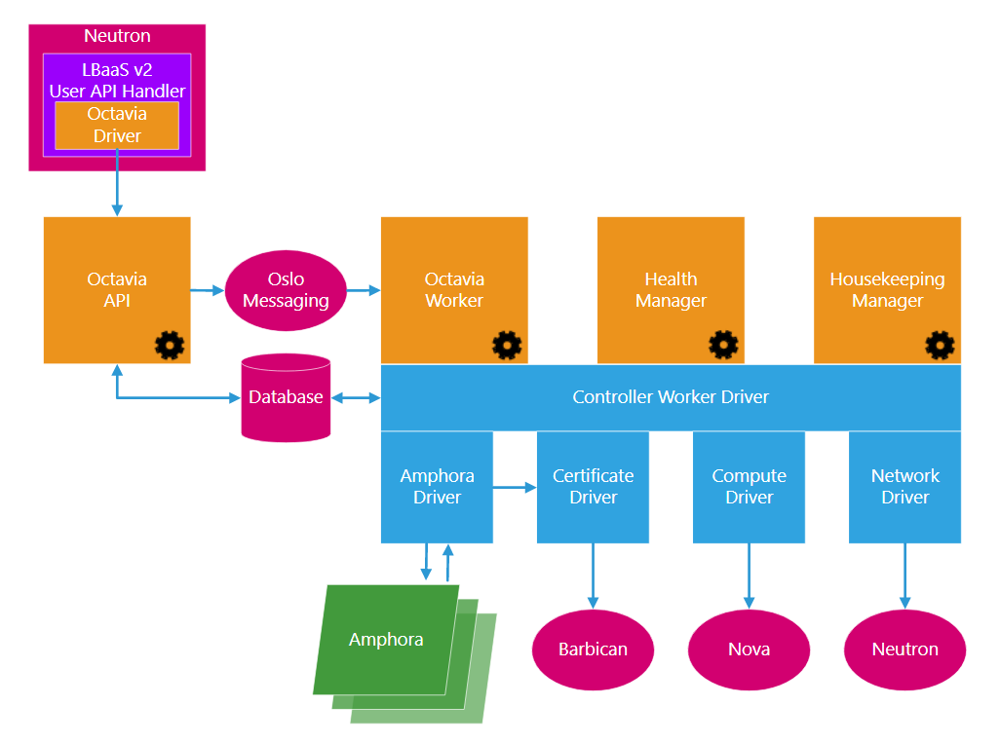

## Tổng quan

### Giới thiệu về Octavia

Octavia là một mã nguồn mở, giải pháp cân bằng tải được thiết kế để làm việc với OpenStack. Octavia được đưa ra khỏi dự án Neutron LBaaS. 
Sự hình thành của nó ảnh hưởng đến sự chuyển đổi của dự án Neutron LBaaS, khi Neutron LBaaS chuyển từ phiên bản 1 sang phiên bản 2. Bắt đầu với việc phát hành 
OpenStack bản Liberty, Octavia đã trở thành ứng dụng tham chiếu cho phiên bản Neutron LBaaS.

Octavia thực hiện việc cung cấp dịch vụ cân bằng tải bằng cách quản lý các VM, container, hoặc BM - gọi chung là amphorae - tùy yêu cầu. Tính năng mở rộng theo yêu cầu và 
theo chiều ngang này giúp phân biệt Octavia với các giải pháp cân bằng tải khác, làm cho Octavia phù hợp với "Cloud".

### Trường hợp Octavia phù hợp với hệ sinh thái OpenStack

Cân bằng tải cần thiết để kích hoạt khả năng mở rộng và khả năng phân phối đơn giản, tự động. Đổi lại, quy mô phân phối và cung cấp ứng dụng phải được coi là các 
tính năng quan trọng của bất kỳ cloud nào.

Do đó, chúng tôi coi Octavia là thiết yếu như Nova, Neutron, Glance hay bất kỳ một dự án "cốt lõi" nào khác cho phép các tính năng thiết yếu của một OpenStack cloud.

Để hoàn thành vai trò của mình, Octavia sử dụng các dự án OpenStack khác:

- **Nova**: Quản lý vòng đời của các amphora và quay vòng tính toán các nguồn lực theo yêu cầu
- **Neutron**: Cung cấp kết nối mạng giữa amphora, môi trường tenant và mạng bên ngoài.
- **Barbican**: Quản lý chứng chỉ và thông tin TLS, khi TLS được cấu hình trên amphorae
- **Keystone**: Để xác thực đối tới octavia API và để Octavia xác thực với các dự án OpenStack khác.
- **Glance**: Để lưu trữ image amphora
- **Oslo**: Để truyền thông giữa các bộ phận điều khoeenr Octavia, làm cho Octavia hoạt động trong framework OpenStack tiêu chuẩn và hệ thống đánh giá, cấu trúc mã dự án
- **Taskflow**: Về mặt kỹ thuật là một phần của Oslo, tuy nhiên, Octavia sử dụng rộng dãi hệ thống taskflow khi điều chỉnh cấu hình và quản lý dịch vụ back-end.

Octavia được thiết kế để tương tác với các thành phần được liệt kê ở trên. Trong mỗi trường hợp, chúng tôi đã quan tâm để xác định tương tác này thông qua giao diện điều khiển. 
Bằng cách đó, các thành phần bên ngoài có thể được thay thế bằng các bộ phận thay thế có chứ năng tương đương mà không cần phải cơ cấu lại các thành phần chính của Octavia. 
Ví dụ, nếu bạn sử dụng một giải pháp SDN khác Neutron trong môi trường của bạn, bạn nên viết một trình điều khiển network Octavia trong môi trường SDN của bạn. 
Một sự thay thế cho trình điều khiển của Neutron tiêu chuẩn trong Octavia.

Điều quan trọng là bạn phải biết rằng, Octavia không nhất thiết được thiết kế như là một sự thay thế hoàn toàn cho dự án Neutron LBaaS. Có nghĩa là, Octavia được thiết kế 
để "cắm vào" với Neutron LBaaS theo cách tương tự như với bất kỳ giải pháp của nhà cung cấp nào: thông qua giao diện điều khiển Neutron LBaaS v2. Bạn có thể nghĩ Octavia là "nhà 
cung cấp mã nguồn mở" cho Neutron LBaaS chứ không phải là một sự thay thế cho Neutron LBaaS. Vì lý do này, chúng tôi khuyên các khách hàng nên cấu hình dịch vụ cân bằng tải 
với Octavia thông qua CLI và API của Neutron LBaaS.

Thời gian tới, Octavia sẽ thay thế Neutron LBaaS như một giải pháp cân bằng tải cho OpenStack. Vào thời điểm đó, các trình điều khiển của nhà cung cấp thứ 3 mà hiện tại 
"cắm vào" Neutron LBaaS sẽ thay thế vào Octavia. Đối với người dùng cuối, quá trình chuyển đổi này tương đối liền mạch vì Octavia hỗ trợ Neutron LBaaS v2 API và nó có một 
giao diện CLI tương tự.

### Ký hiệu Octavia

Trước khi tiếp tục bài giới thiệu, vui lòng lưu ý sau:

Kinh nghiệm cho thấy rằng, trong ngành CNTT tạo ra, triển khai và sử dụng thiết bị cân bằng tải hoặc dịch vụ - thuật ngữ được sử dụng không nhất quán. 
Để giảm bớt sự nhầm lẫn, nhóm Octavia đã tạo một bảng thuật ngữ khi chúng được định nghĩa và sử dụng trong khuôn khổ dự án Octavia và Neutron LBaaS v2. Bản chú thích trong 
[link](https://docs.openstack.org/octavia/pike/reference/glossary.html)

Nếu bạn đã quen thuộc với các điều khoản và cách sử dụng Neutron LBaaS v1, đặc biệt, quan trọng bạn phải hiểu ý nghĩa của thuật ngữ "VIP", “load balancer,” and “load balancing,” 
đã được thay đổi trọng Neutron LBaaS v2.

Việc sử dụng các thuật ngữ này phải phù hợp với bảng thuật ngữ Octavia trong các tài liệu của Octavia, trong các cuộc thảo luận do các thành viên của Octavia tổ chức 
trên các email cộng đồng, kênh IRC, và các hội nghị. Để tránh hiểu nhầm, bạn nên tự làm quen với những định nghĩa thuật ngữ.

### Tổng quan về các thành phần của Octavia



Octavia v0.9 bao gồm các thành phần chính sau:

- **amphorae**: Amphorae là những máy ảo, container, hoặc BM server để hoàn thành việc cung cấp các dịch vụ cân bằng tải cho các môi trường ứng dụng. 
Trong Octavia v0.8 Việc tham chiếu amphorae là một máy ảo Ubuntu chạy HAProxy.
- **controller**: Controller là "bộ não" của Octavia. Nó bao gồm 4 thành phần nhỏ, đó là các deamon riêng biệt. Chúng có thể được chạy trên các hạ tầng back-end riêng biệt nếu muốn.
    - **API Controller**: Như tên gọi, phần này sử dụng API của Octavia. Cần phải có các yêu cầu API, thực hiện việc xử lý đơn giản và chuyển yêu cầu tới Controller Worker thông qua Oslo.
    - **Controller Worker**: Thành phần này sẽ nhận các lệnh API đã được xử lý từ API controller và thực hiện các hành động cần thiết để hoàn thành yêu cầu API.
    - **Health Manager**: Phần này theo dõi từng amphorae để đảm bảo chúng hoạt động và tốt. Nó xử lý sự cố chuyển đổi dự phòng nếu amphorae bị lỗi bất ngờ.3
    - **Housekeeping Manager**: Phần này sẽ dọn dẹp các bản ghi cơ sở dữ liệu lỗi (xóa), quản lý amphora và quản lý vòng quay chứng chỉ amphora.
- **network**: Octavia không thể thực hiện được nó mà không cần thao tác môi trường mạng. Amphorae được kết nối một giao diện mạng trên "load balancer network", và chúng cũng 
có thể cắm trực tiếp vào các tenant network của các pool member, tùy thuộc vào cách dịch vụ cân bằng tải được triển khai bởi người sử dụng.

## Cài đặt

### Devstack

Thực hiện cài đặt bằng devstack rất đơn giản.

**Bước 1**:

Chuẩn bị một máy chủ cài có cấu hình 6 vCPU, 8GB RAM, 60GB HDD, 02 interface (public + private). Cài đặt hệ điều hành Ubuntu 16.04 64bits.

Máy có kết nối internet, và đã cài đặt sẵn các gói `wget, git`
```sh
apt-get update -y && apt-get dist-upgrade -y && apt-get install wget git -y
```

**Bước 2**:

Đăng nhập vào với quyền `root` và tải script sau về:

- Nếu sử dụng OpenStack ocata
```sh
wget https://raw.githubusercontent.com/openstack/octavia/stable/ocata/devstack/contrib/new-octavia-devstack.sh
```

- Nếu sử dụng OpenStack pike:
```sh
wget https://raw.githubusercontent.com/openstack/octavia/stable/pike/devstack/contrib/new-octavia-devstack.sh
```

**Bước 3**:

Cho script quyền thực thi
```sh
chmod + x new-octavia-devstack.sh
```

Chạy lệnh sau để bắt đầu cài đặt
```sh
./new-octavia-devstack.sh
```

Quá trình cài đặt mất khoảng 1h30p. Vì cài đặt từ source nên sẽ bao gồm cả bước biên dịch và cài đặt.

**Bước 4**:

Việc cài đặt vẫn thiếu horizon, nên bạn cần cài đặt thêm gói horizon nếu muốn thao tác và xem qua web.

Từ user `stack`, ta chạy lệnh sau:
```sh
sudo apt-get install openstack-dashboard -y
```

Cài đặt xong, ta chay đổi cấu hình của file `/etc/openstack-dashboard/local_settings.py` như sau:
```sh
OPENSTACK_API_VERSIONS = {
    "identity": 3,
    "image": 2,
    "volume": 2,
}

OPENSTACK_KEYSTONE_DEFAULT_DOMAIN = "Default"

OPENSTACK_HOST = "172.16.68.59"

OPENSTACK_KEYSTONE_URL = "http://%s/identity" % OPENSTACK_HOST

OPENSTACK_KEYSTONE_DEFAULT_ROLE = "user"

SESSION_ENGINE = 'django.contrib.sessions.backends.cache'
OPENSTACK_KEYSTONE_MULTIDOMAIN_SUPPORT = True

TIME_ZONE = "Asia/Ho_Chi_Minh"
```

Thực hiện khởi động lại `apache2` để bắt đầu sử dụng `horizon`
```sh
sudo service apache2 reload
```

### Package

## Cấu hình

### Devstack

Cài đặt bằng devstack đã cấu hình sẵn, chỉ việc đăng nhập và sử dụng. Việc cài đặt là all-in-one - tất cả các gói được cài đặt trên một máy chủ.

### Package

## Sử dụng

### Devstack

Đăng nhập vào máy chủ và chuyển sang user `stack` hoặc đăng nhập vào horizon với user/password là `admin/secretadmin`

## Tham khảo

- [https://docs.openstack.org/octavia/pike/reference/introduction.html](https://docs.openstack.org/octavia/pike/reference/introduction.html)